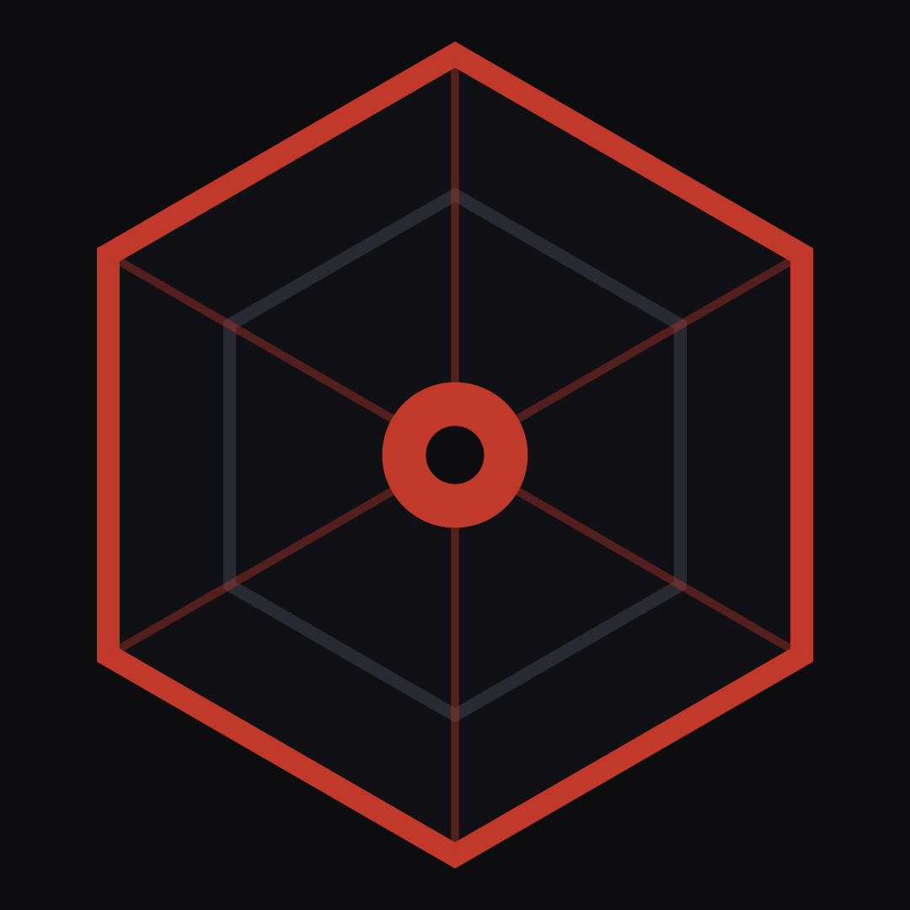

<div align="center">
  
  <h1>VXRT</h1>
  <p><strong>Elite Offensive Security Operations</strong></p>
  <p>Attack first. Defend always.</p>
</div>

---

## About VXRT

VXRT is a premier offensive security firm specializing in penetration testing, red team operations, exploit development, and adversary simulation. We help organizations identify and remediate critical vulnerabilities before malicious actors can exploit them.

## Services

- **Penetration Testing** - Network, web application, and API security assessments
- **Red Teaming** - Full-scope adversary simulation operations
- **Vulnerability Assessment** - Systematic identification of security weaknesses
- **Cloud Penetration Testing** - AWS, Azure, and GCP security reviews
- **Exploit Development** - Custom vulnerability research and proof-of-concepts
- **Purple Teaming** - Collaborative attack and defense optimization

## Tech Stack

- **Framework:** React + TypeScript
- **Styling:** Tailwind CSS
- **UI Components:** shadcn/ui
- **Animations:** Framer Motion
- **Icons:** Lucide React
- **Build Tool:** Vite

## Getting Started

### Prerequisites

- Node.js 18+
- npm or yarn

### Installation

```bash
# Clone the repository
git clone https://github.com/vxrt-offsec/vxrt-website.git

# Navigate to project directory
cd vxrt-website

# Install dependencies
npm install

# Start development server
npm run dev
```

### Build for Production

```bash
npm run build
```

## Project Structure

```
src/
├── components/
│   ├── layout/          # Navbar, Footer, MainLayout
│   ├── service/         # Service page templates
│   ├── shared/          # Reusable components (SectionHeading, AnimatedCounter, etc.)
│   └── ui/              # shadcn/ui components
├── pages/
│   ├── data/            # Services and products data
│   ├── product/         # Product pages (Compute, VPS, Kubernetes, etc.)
│   ├── service/         # Service pages (Pentesting, Red Team, etc.)
│   ├── HomePage.tsx
│   ├── TeamPage.tsx
│   ├── PricingPage.tsx
│   ├── ResourcesPage.tsx
│   ├── ContactPage.tsx
│   └── ...
├── App.tsx
└── main.tsx
```

## Features

- Responsive design optimized for all devices
- Smooth page transitions and scroll animations
- Dark theme with red accent colors
- Interactive team organization chart
- Animated pricing cards with comparison table
- FAQ accordion with smooth expand/collapse
- Resource center with CVE database
- Community integration with Discord

## Contact

- **Website:** [vxrt.io](https://vxrt.io)
- **Email:** contact@vxrt.io
- **Discord:** [Join our community](https://discord.gg/vxrt)

---

<div align="center">
  <p>© 2025 VXRT Offensive Security. All rights reserved.</p>
</div>
